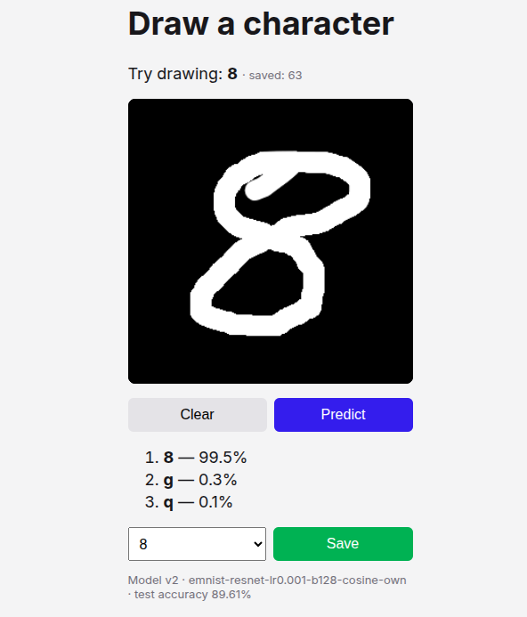

# digit-classifier

[](https://github.com/m3h3d1/digit-classifier/actions/workflows/ci.yml)

Draw a digit or letter in the browser; a model predicts it.



## How it works

```
train (GPU) → track (MLflow) → gate + registry → serve (FastAPI, ONNX, Docker)
     ▲                                                   │
     └── retrain on new drawings or drift ◄── collect drawings (DVC) + monitor (PSI)
```

- **Model:** ResNet-18 or a small CNN on EMNIST balanced (47 classes)
- **Gate:** a model is promoted only if its ONNX output matches PyTorch, its EMNIST accuracy drops at most 0.5%,
  and it is at least as accurate on held-out drawings from the app

## Results

| Model | EMNIST test | Held-out app drawings |
|---|---|---|
| Small CNN | 86.1% | – |
| ResNet-18 | 87.6% | – |
| ResNet-18 + cosine LR (v1) | 89.4% | 94% (15/16) |
| + own drawings (v2) | **89.6%** | 94% (17/18) |

Too few app drawings so far to show a gain from them; v1 was right on 74% of drawings while they were collected.

## Layout

| Folder | Runs on | Purpose |
|---|---|---|
| `training/` | GPU | train, evaluate, export to ONNX |
| `ops/` | local | tracking, gate, data checks, monitoring, pipeline, deploy |
| `app/` | local / Docker | drawing page and prediction API |
| `tests/` | local / CI | tests with fake models |

## Usage

Needs `make`, [`uv`](https://docs.astral.sh/uv/), Docker and DVC; training needs a GPU machine.
The trained model and drawings are not in the repo, so train first.

```sh
make results DATASET=emnist MODEL=resnet SCHED=cosine OWN=1   # on the GPU
make track && make report DATASET=emnist                      # log and compare runs (MLflow)
make promote && make bundle                                   # gate, register, package the production model
make serve                                                    # http://127.0.0.1:8000
make data                                                     # validate and version saved drawings (DVC)
make monitor                                                  # live accuracy and drift
make pipeline                                                 # retrain → gate → build → deploy with rollback
make lint test                                                # no GPU needed
```
